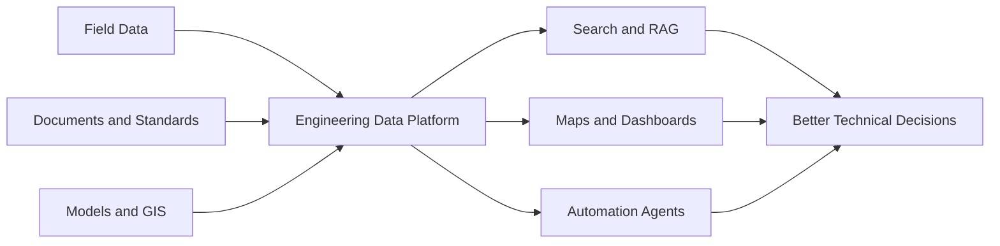

<div align="center">

# Amaljit Bharali

### Civil Engineer building open-source digital systems for water infrastructure

**Water Systems · GIS · Digital Twins · AI Automation · Docker · IoT/SCADA**

[](https://github.com/amaljit3022)
[](https://www.linkedin.com/in/amaljitbharali)
[](mailto:amaljit.bharali@gmail.com)


</div>

---

## Engineering × Open Source × Automation

I am a **Civil Engineer working in public water infrastructure in Assam, India**.

My professional work involves pressurised water-supply systems, 24×7 drink-from-tap projects, hydraulic modelling, DPR review, GIS, field data, IoT, and SCADA. Alongside engineering, I build practical software and automation systems for organising technical information, improving workflows, and connecting engineering data with maps, models, documents, and AI.

> **My focus:** converting fragmented engineering data and repetitive processes into connected, reusable, and auditable digital systems.

---

## What I Work On

<table>
<tr>
<td width="50%" valign="top">

### Water Infrastructure

- Pressurised distribution systems
- 24×7 water-supply projects
- Hydraulic modelling
- DPR and technical-design review
- Water-source sustainability
- Utility asset and operational data

</td>
<td width="50%" valign="top">

### Digital Engineering

- GIS and remote-sensing workflows
- Engineering web applications
- Field-data and map-based tools
- IoT and SCADA integration
- Digital twins and model repositories
- Engineering knowledge systems

</td>
</tr>
</table>

---

## Current and Selected Builds

| Project | Purpose | Status |
|---|---|---|
| **Assam HydroTwin** | Central platform for hydrology data, engineering models, maps, provenance, analysis, and reusable model workflows. | Active development |
| **Krittika Odyssey OS** | Personal knowledge, automation, project, document, and AI-agent hub built as a modular local-first platform. | Active development |
| **GeoCam Field** | Android field camera with geotagged photographs, notes, compass information, gallery review, and map-based browsing. | Active development |
| **APHEA Connect** | Searchable organisational and officer directory for public-health engineering professionals. | Active development |
| **H2OMCQHub** | Structured learning platform for water, sanitation, engineering manuals, progress tracking, and assessment. | Ongoing |
| **Engineering Web Calculator** | Browser-based engineering calculators, converters, hydraulic utilities, and date/time tools. | Ongoing |
| **HydroVision** | Remote-sensing workflows for water-body identification, NDWI analysis, and change monitoring. | Prototype |
| **Frame2Prompt** | Workflow for analysing visual references and producing reusable, structured generation prompts. | Active development |

> Some systems are currently local or private while documentation and public-release structures are being prepared.

[**View my public repositories →**](https://github.com/amaljit3022?tab=repositories)

---

## Tools I Actively Use

These are tools and platforms I have used in engineering work, personal projects, local development, or active repositories.

### Development

<p>


</p>

### Containers, Data, and Local AI

<p>


</p>

### Engineering, GIS, and Field Tools

<p>


</p>

### Development Environment

<p>


</p>

---

## Open-Source and Local-First Approach

I prefer systems that are:

- **open source** rather than dependent on closed, non-portable platforms
- **local first** where privacy, technical documents, or official data are involved
- **Dockerised** for reproducible setup, migration, backup, and deployment
- **modular** so established tools can be integrated instead of unnecessarily recreated
- **human readable** through Markdown, documented schemas, and transparent configurations
- **automation friendly** so repetitive work can be delegated to scripts and agents
- **auditable** with provenance, version control, validation, and non-destructive workflows

### Preferred knowledge architecture

```text
PostgreSQL / PostGIS  →  Structured source of truth
Qdrant                →  Semantic retrieval and memory
Markdown repositories →  Human-readable knowledge
Ollama / local LLMs   →  Private AI processing
AI agents             →  Workflow orchestration
Docker Compose        →  Reproducible services
Maps and dashboards   →  Engineering decisions
```

---

## Technical Interests

These are areas I am actively studying, prototyping, or planning around. They are not presented as claims of mastery.

- Agentic AI and low-intervention development workflows
- Retrieval-augmented generation and engineering document intelligence
- Local language models, private AI, and self-hosted AI services
- Docker-based home servers and self-hosted applications
- Open-source GIS, web maps, spatial databases, and field-data systems
- Hydrology, hydraulic modelling, flood modelling, and engineering digital twins
- IoT and SCADA automation for public water utilities
- Climate resilience, water security, and source sustainability
- Android utilities for engineers and field teams
- Structured repositories, model registries, provenance, and knowledge graphs
- Workflow automation across documents, email, field records, and project data
- Code-first animation, technical visualisation, Blender, and 3D workflows
- Open-source creative and publishing pipelines

---

## What I Am Building Toward



The long-term goal is not a collection of disconnected applications. It is an interoperable ecosystem where engineering data, documents, models, maps, and automation can work together.

---

## Writing and Knowledge Sharing

I write and build around:

- practical engineering automation
- water, GIS, and digital infrastructure
- open-source and self-hosted software
- AI-assisted development and RAG systems
- technical tutorials and reusable scripts
- **The Krittika Odyssey** — technology, learning, family, creativity, and building for the future

---

## Beyond Engineering

`Technical Blogging` · `Photography` · `3D and Blender` · `Code-driven Animation` · `Sci-fi` · `Strategy Games` · `Software and Gadgets`

---

## Collaboration

I am interested in practical collaboration involving:

- water and environmental engineering
- engineering digital twins
- open-source GIS and hydrology
- public-utility digital systems
- local-first AI and automation
- field applications for infrastructure teams
- reproducible Docker-based engineering platforms

<div align="center">

### Building useful systems where engineering knowledge meets open-source software.

**Amaljit Bharali · Assam, India**

</div>
